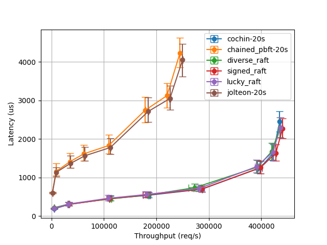

# PirateShip

This is a prototype implementation of the PirateShip consensus protocol for VM-based TEEs (eg, AMD SEV-SNP and Intel TDX).

> WARNING: Code is still under development and is not audited. DO NOT use it in production.

## Supported protocols

We use Rust features to use the same codebase to implement multiple protocols for benchmarking.
Protocols currently available are:

- PirateShip
- Raft (also called `lucky_raft`)
- Signed Raft
- PBFT (Linearized version)
- Jolteon
- Hotstuff
- Engraft

All protocols except PirateShip only have their steady-states implemented without leader election/view change.

## Building

PirateShip uses Rust. So `cargo build` should suffice.
For convenience, we have provided a `Makefile` with multiple targets for different protocols and PirateShip with different features/apps.

See `Makefile` for more details.

## Deployment

See `scripts` for instructions on how to deploy and run PirateShip experiments.
The `deployment` directory is tailor-made for deploying VMs in Azure using Terraform.
However, porting to another cloud is possible: subclass the `Deployment` class in `scripts` to use your own deployment scripts.

## Current Performance Results

**Setup**: 7 node LAN setup with 16 core SEV nodes with 64 GB RAM and 10 Gbps NIC capacity.

## Correctness

PirateShip has been modelled in TLA+: https://github.com/PirateshipOrg/pirateship-tla
